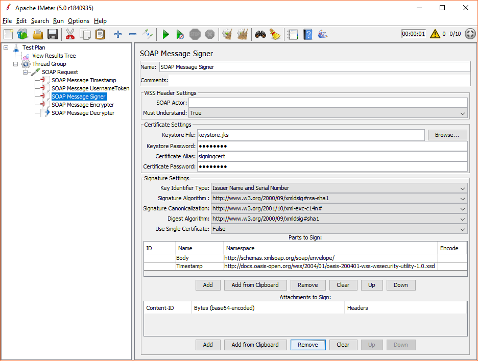
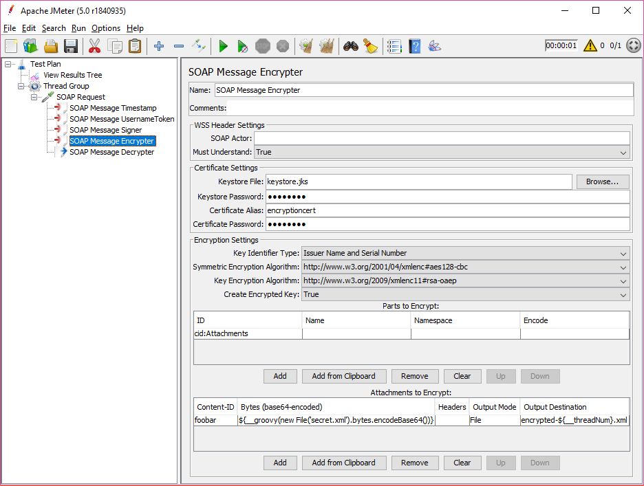
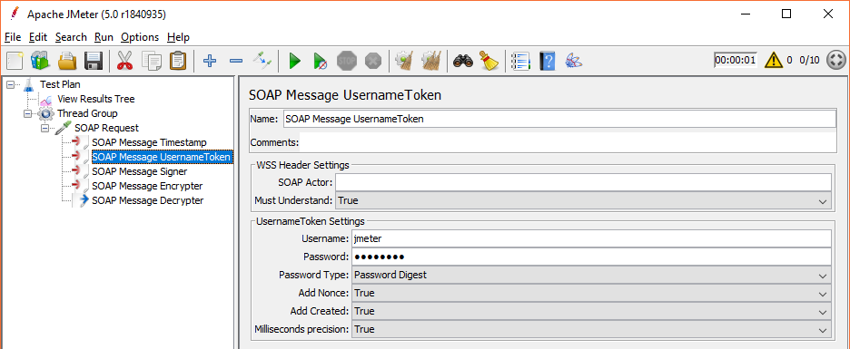
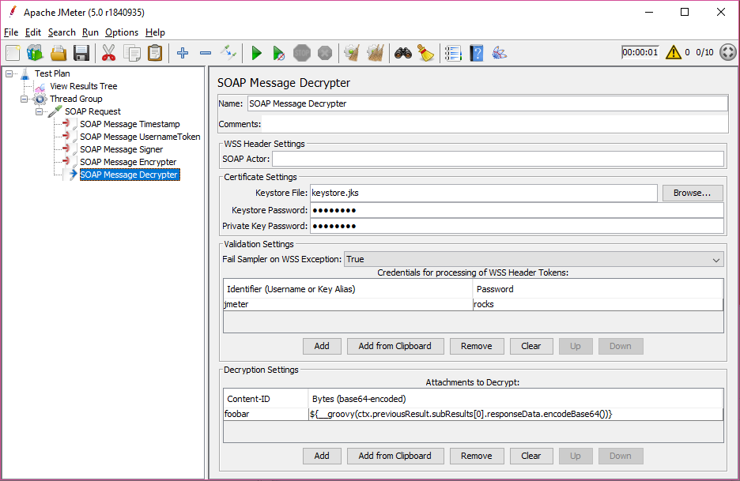

# jmeter-wssecurity [![travis][travis-image]][travis-url]

[travis-image]: https://travis-ci.org/tilln/jmeter-wssecurity.svg?branch=master
[travis-url]: https://travis-ci.org/tilln/jmeter-wssecurity

Overview
------------

Apache JMeter plugin for signing, encrypting and decrypting SOAP messages (WS-Security).

The plugin provides 
* [Pre-Processors](http://jmeter.apache.org/usermanual/component_reference.html#preprocessors) 
for adding digital signature or encryption to a sampler's payload (based on a certificate from a given keystore),
* Pre-Processors for adding a Username Token or a Timestamp to a sampler's payload,
* a [Post-Processor](http://jmeter.apache.org/usermanual/component_reference.html#postprocessors)
for decrypting a sampler's response.

Supported are HTTP Request, JMS Publisher and JMS Point-to-Point samplers, SMTP and TCP sampler,
as well as third party samplers that expose the payload via a
JMeter [StringProperty](https://jmeter.apache.org/api/org/apache/jmeter/testelement/property/StringProperty.html)
or a pair of getter/setter methods.

Installation
------------

### Via [PluginsManager](https://jmeter-plugins.org/wiki/PluginsManager/)

Under tab "Available Plugins", select "WS Security for SOAP", then click "Apply Changes and Restart JMeter".

### Via Package from [JMeter-Plugins.org](https://jmeter-plugins.org/)

1. Remove wss4j-\*.jar and xmlsec-\*.jar from JMeter's lib directory (if applicable).
2. Download and extract the [zip package](https://jmeter-plugins.org/files/packages/tilln-wssecurity-1.6.zip) into JMeter's lib directory.
3. Restart JMeter.

### Via Manual Download

1. Copy the [jmeter-wssecurity jar file](https://github.com/tilln/jmeter-wssecurity/releases/download/1.6/jmeter-wssecurity-1.6.jar) into JMeter's lib/ext directory.
2. Copy the following dependencies into JMeter's lib directory:
	* [org.apache.wss4j / wss4j-ws-security-dom](https://search.maven.org/remotecontent?filepath=org/apache/wss4j/wss4j-ws-security-dom/2.2.2/wss4j-ws-security-dom-2.2.2.jar)
	* [org.apache.wss4j / wss4j-ws-security-common](https://search.maven.org/remotecontent?filepath=org/apache/wss4j/wss4j-ws-security-common/2.2.2/wss4j-ws-security-common-2.2.2.jar)
	* [org.apache.santuario / xmlsec](https://search.maven.org/remotecontent?filepath=org/apache/santuario/xmlsec/2.1.2/xmlsec-2.1.2.jar)
3. Make sure to remove older versions of the above dependencies from the JMeter lib directory.
4. Restart JMeter.

Usage
------------

From the context menu, add the appropriate Pre or Post Processor to the test plan scope with the sampler containing the SOAP message.

The message to be signed or encrypted must be a valid SOAP message and must be in one of the following locations:
* For [HTTP request](http://jmeter.apache.org/usermanual/component_reference.html#HTTP_Request): Tab "Body Data" (not "Parameters")
* For [JMS Point-to-Point](http://jmeter.apache.org/usermanual/component_reference.html#JMS_Point-to-Point): Text area "Content"
* For [JMS Publisher](http://jmeter.apache.org/usermanual/component_reference.html#JMS_Publisher): Text area "Text Message..." with "Message source": Textarea (from files is not supported)
* For [SMTP Sampler](http://jmeter.apache.org/usermanual/component_reference.html#SMTP_Sampler): Text area "Message" ("Send .eml" unchecked)
* For [TCP Sampler](http://jmeter.apache.org/usermanual/component_reference.html#TCP_Sampler): Text area "Text to send"

*Note that the plugin does not assist with composing the message nor does it do any XML schema validation.
Only the WS-Security header element will be inserted or modified.*
*It is recommended to exclude the WS-Security header from the SOAP request and let the plugin generate it.*

Users familiar with SoapUI will find similarities to the [outgoing WS-Security configuration](https://www.soapui.org/soapui-projects/ws-security.html#3-Outgoing-WS-Security-configurations).

### SOAP Message Signer



### SOAP Message Encrypter



### SOAP Message Username Token



### SOAP Message Timestamp


### SOAP Message Decrypter



Configuration
-------------

### Pre-Processors

The dropdown fields allow for the customization of most signature and encryption settings, depending on what the endpoint's WSDL defines.

#### Parts to Sign/Parts to Encrypt

These lists are empty by default, however, that results in the SOAP Body content to be signed or encrypted.

Suppose the Timestamp element was to be included in the signature or encryption in addition to the Body element, both would have to be listed as follows: 

|ID|Name|Namespace|Encode|
|--|----|---------|------|
|  |Body|http://schemas.xmlsoap.org/soap/envelope/ | |
|  |Timestamp|http://docs.oasis-open.org/wss/2004/01/oasis-200401-wss-wssecurity-utility-1.0.xsd | |

If there are multiple XML elements with the same name and namespace, the element's ID attribute can be used to determine which element is to be signed/encrypted.
If the ID is specified, the Name and Namespace are not necessary and will not be used.  

Example:

```xml
<soap:Envelope xmlns:soap="http://schemas.xmlsoap.org/soap/envelope/">
    <soap:Body>
        <element ID="e1">this should be encrypted</element>
        <element ID="e2">this is not to be encrypted</element>
        <element>another one</element>
    </soap:Body>
</soap:Envelope>
```

|ID|Name|Namespace|Encode|
|--|----|---------|------|
|e1|    |         |      |

Encode is only relevant for encryption (or attachments, see below) and can be one of the following:
* "Element" (default): The entire XML element is encrypted.
* "Content": Only child nodes of the XML element are encrypted (i.e. the element name and its attributes will remain in clear text).
* "Header": Encloses the XML element in an EncryptedHeader element ("http://docs.oasis-open.org/wss/oasis-wss-wssecurity-secext-1.1.xsd"), 
but only if it is an immediate child node of the SOAP Header.

### Post-Processor

Any WS-Security related exception encountered by the SOAP Message Decrypter 
while trying to decrypt a response message will cause the sampler to fail and will create an 
[assertion](http://jmeter.apache.org/usermanual/component_reference.html#assertions) result, 
effectively behaving like an implicit assertion.

If this behaviour is not desired, it may be turned off via setting the JMeter property `jmeter.wssecurity.failSamplerOnWSSException=false`.

### Support for 3rd party samplers

Samplers that are not JMeter core functionality, such as [JMeter-Plugins](http://jmeter-plugins.org), can also be used
if they provide either a JMeter StringProperty or a public String getter/setter to access the sampler's payload with the SOAP message.

In that case, the JMeter property `jmeter.wssecurity.samplerPayloadAccessors` can be set to specify the class name and property name as in the following examples.

The SMTP Sampler stores the payload in the TestElement property ["SMTPSampler.message"](https://github.com/apache/jmeter/blob/v4_0/src/protocol/mail/org/apache/jmeter/protocol/smtp/sampler/SmtpSampler.java#L91).
So, it would be configured for this plugin via
`jmeter.wssecurity.samplerPayloadAccessors=org.apache.jmeter.protocol.smtp.sampler.SmtpSampler."SMTPSampler.message"`.
Note the quotes around the property name if it contains a dot.

Alternatively, if there is no such JMeter property, a Bean property can be used (without the get/set prefix),
which the Pre-Processor will access at run time via Reflection.

Suppose a sampler like the following:
```java
package some.package;
public class SomeSampler extends AbstractSampler {
	public String getPayload() 
	// ...
	public void setPayload(String content)
	// ...
}
```

Then the JMeter property should be set like so: `jmeter.wssecurity.samplerPayloadAccessors=some.package.SomeSampler.payload`

More than one of these can be comma separated (if really required).

### Support for Attachments

SOAP Message [Attachments](http://docs.oasis-open.org/wss-m/wss/v1.1.1/os/wss-SwAProfile-v1.1.1-os.html)
can be digitally secured or validated/decrypted by the plugin.
However, the attachment data must be explicitely provided and must match the attachment(s) transmitted by the sampler,
i.e. the plugin is unable to automatically access samplers' attachments.
To do this, the below lists (Attachments to Sign/Encrypt/Decrypt) have to be filled in with one row for each attachment.

Additionally, for SwA attachments, the special ID `cid:Attachments` needs to be added to the "Parts to Sign"/"Parts to Encrypt" (without Name or Namespace).
The Encode column can be either:
* "Element": The attachment content will be signed/encrypted as well as the MIME headers `Content-Description`, `Content-Disposition`, `Content-ID`, `Content-Location`, `Content-Type`.
* "Content" (default): Only the attachment content will be signed/encrypted.

#### Attachments to Sign

An attachment is identified by its Content-ID (`cid:`) and consists of a sequence of bytes and (optionally) some headers.
The following columns need to be populated accordingly:
* Content-ID: The identifier attribute the attachment will be referenced by in the SOAP message.
* Bytes: Base64-encoded content. This may come from anywhere, e.g. a file or a JMeter variable,
and will typically be using some custom code snippet via the [`__groovy()` function](https://jmeter.apache.org/usermanual/functions.html#__groovy),
such as `${__groovy(new File('secret.xml').bytes.encodeBase64())}`
* Headers: Newline-separated headers. Note: JMeter GUI fields do not allow newlines. Use [`${__char(13)}`](https://jmeter.apache.org/usermanual/functions.html#__char).

#### Attachments to Encrypt

The Content-ID, Bytes and Headers columns have the same semantics as above.

After encrypting an attachment, the plugin can make the encrypted data available to the sampler for transmission.
This can be done is a few different ways. The following columns determine how the plugin stores the output:
* Output Mode: Defines how the encrypted attachment will be handed over to the sampler, and can be one of the following:
    * "File": Store encrypted bytes in a file (name and path as per "Output Destination" column)
    * "Variable": Assign encrypted bytes to JMeter object [variable](https://jmeter.apache.org/usermanual/best-practices.html#bsh_variables) of type `byte[]` (variable name as per "Output Destination" column)
    * "Context": Store encrypted bytes in sampler context as object `byte[]` (context map key as per "Output Destination" column)
    * "Property": Assign encrypted bytes to a sampler ObjectProperty (property name as per "Output Destination" column)
    * "Base64": Assign encrypted bytes to JMeter variable as a base64-encoded String (variable name as per "Output Destination" column)
* Output Destination: Name of the file/variable/property that will hold the encrypted attachment data.

Notes:
* For Encode="Element" (`Attachment-Complete` as above), headers will be contained within the encrypted data.
However, this plugin cannot modify the headers sent by the sampler, so the user needs to ensure
that sensitive headers are removed from the attachment part.
* The `Content-Type` header value may be required for the `<xenc:EncryptedData>` MimeType attribute
as per [processing rules](http://docs.oasis-open.org/wss-m/wss/v1.1.1/os/wss-SwAProfile-v1.1.1-os.html#_Toc307412712),
so the user needs to provide it in the Headers column.

#### Attachments to Decrypt

The plugin can also decrypt response attachments. They need to be listed as follows:
* Content-ID: The Content-ID to tie the attachment back to a reference in the WSS header.
* Bytes: Base64-encoded encrypted data from the sample response.
This will most likely be retrieved by some custom code snippet via [`__groovy()`](https://jmeter.apache.org/usermanual/functions.html#__groovy)
accessing [`ctx.previousResult.subResults`](https://jmeter.apache.org/api/org/apache/jmeter/samplers/SampleResult.html#getSubResults--),
depending on how the sampler handles response attachments.
Example: `${__groovy(ctx.previousResult.subResults[0].responseData.encodeBase64())}`

Note: If an attachment is referenced in the response's WSS header but not included in the "Attachments to Decrypt" list, response validation will fail.

The decrypted attachment content (and possibly headers) will be stored as a sub-sample of the main sample.
The plugin will try to find a sub-sample that matches the attachment's Content-ID and if a match is found replace the sub-sample,
or otherwise create a new sub-sample and add it to the main sample.

The search is done via recursively traversing all sub-samples (depth-first), and looking at either the sub-sample's Content-ID response header
or the sub-sample's label.
This can be configured via the JMeter property `jmeter.wssecurity.findAttachmentsBySampleLabel`:
1. If undefined/empty, use the Content-ID response header for matching the attachment's cid.
2. If defined/non-empty, use this regular expression's first capture group for matching the attachment's cid.

Example:

Suppose a sampler generates a main sample with an attachment sub-sample "somecontentid (text/xml)" but does not set the Content-ID header.
Using the property value `jmeter.wssecurity.findAttachmentsBySampleLabel=(.*) \(.*\)` this sub-sample will be identified based on the first matcher group "somecontentid".

Troubleshooting
---------------

The signed or encrypted message payload can be inspected via "View Results Tree".

To avoid common problems, make sure that:
- the Keystore contains an entry for the specified certificate alias,
- the certificate and signature/encryption algorithms match,
- the SOAP message is correctly formed and can be parsed,
- [Unlimited Strength JCE](http://www.oracle.com/technetwork/java/javase/downloads/jce8-download-2133166.html) is installed to support all key lengths,
etc.

It may be useful to increase the logging level in order to investigate any keystore or encryption related issues, 
for example by adding `--loglevel=org.apache.wss4j=DEBUG` to the JMeter command line. 

It may also be helpful to inspect server side logs, especially for HTTP 500 type responses, unspecific SOAP Fault messages etc.
